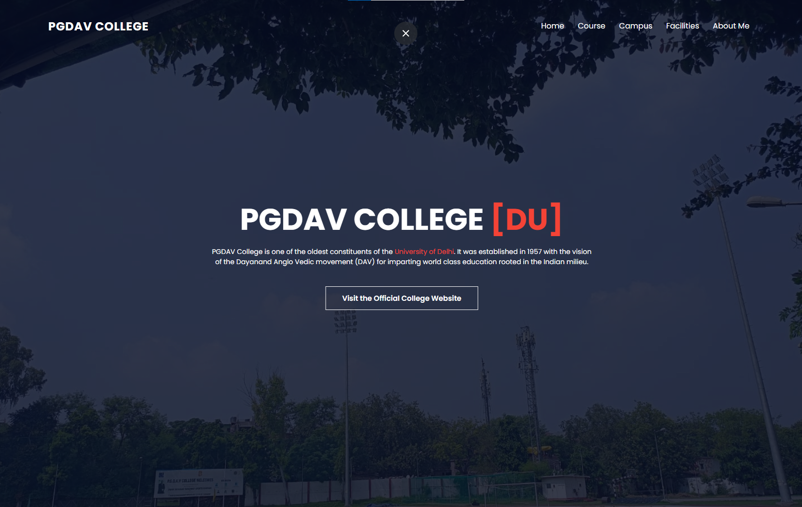

# PGDAV College Webpage 🌟

 <!-- Replace with your actual image path -->

## Project Description 🎓

This webpage showcases PGDAV College, one of the oldest constituent colleges of the University of Delhi. Established in 1957, the college aims to provide world-class education rooted in Indian values.

### Features

- **Course Offerings**: Detailed sections on various undergraduate and postgraduate courses.
- **Campus Overview**: Information about the college's facilities and campus life.
- **Personal Touch**: An "About Me" section sharing my experiences as a B.Com student.

### How It Works 💡

- The webpage is structured with HTML to present information clearly and elegantly.
- CSS is used for styling, ensuring a visually appealing layout that enhances user experience.

### Tech Stack

- **HTML**: For structuring the content.
- **CSS**: For styling the webpage.

### Getting Started 🚀

To view the PGDAV College webpage:

1. Clone the repository:
   ```bash
   git clone https://github.com/arjunmalpani/COLLEGE-WEBSITE.git
